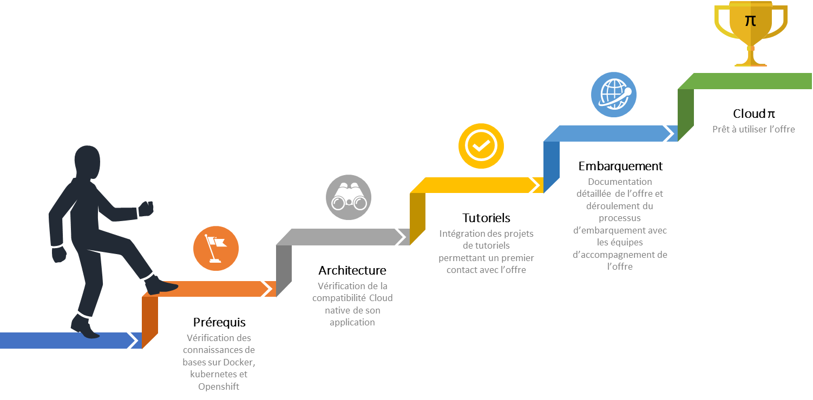

# Cloud π Native

:warning: __*La plateforme est en cours de construction et des évolutions fréquentes sont à prévoir.*__ :warning:

## L'offre

### Présentation 

Avec l’adoption de la doctrine « Cloud au centre », le Gouvernement Français fait du Cloud un prérequis pour tout nouveau projet numérique au sein de l’État ou refonte substantielle de l’architecture applicative existante.

**Objectif** : accélérer la transformation numérique au bénéfice des usagers et dans le strict respect de la cybersécurité et de la protection des données des citoyens et des entreprises.

L'offre interministérielle Cloud π Native, offre les services d'une plateforme DevSecOps complète afin de suivre le cycle de vie complet de son projet.

La philosophie de l'offre est de créer une chaine collaborative étendue entre l'équipe de développement et l'hébergement, qui s'appuient sur :
 - un socle d'intégration à la main des développeurs, appellée chaine primaire.
 - un service côté infrastructure étatique effectuant la recompilation du code et l'automatisation des déploiement, appellée chaine secondaire. 
 
La chaine secondaire est également en charge de mesurer la qualité du code et la conduite d'audits automatisés à chaque build/déploiement contribuant à l'homologation en continu de l'application.

L'usage de standards industriels largement distribués tel que kubernetes et Gitops et la sécabilité de l'offre, permettent un transfert facilité depuis et vers d'autres solutions d'hébergement kubernetes telles que les Clouds Publics.

Le cadre interministériel d'utilisaton de l'offre est disponible à l'emplacement suivant : <https://github.com/cloud-pi-native/cct-cloud-native>

Lorsque que l'équipe projet est prête avec un première base de code fonctionnelle, il est possible de l'intégrer sur l'offre Cloud π Native.

La séquence d'accès typique est la suivante :

  - Effectuer une demande d'accès au service via le formulaire suivant : <https://www.demarches-simplifiees.fr/commencer/cloud-pi-native> par un correspondant étatique ayant la compétence pour accepter les conditions CGU et fournir les données d'imputation budgétaire (UO).
  - Après acceptation du dossier, l'enrollement du projet est effectuté dans la console Cloud pi Native, et l'équipe projet est en charge d'instancier les ressources nécessaires (gitlab, vault, registry, etc...) dans la chaine secondaire et de configurer son projet  ;
  - Recopie des repository de code et de déploiement;
  - Mise en place du pipeline "DevSecOps" au sein de la chaine secondaire. L'application reste maître de son pipeline et de sa surveillance;
  - Mise en place du/des namespaces dans le cluster cible ainsi des secrets nécessaires au fonctionnement et du provisionning gitops de l'application (argoCD);
  - Provisionning des ressources d'infrastructure additionnelles ( certificats, ouverture de fluxs, bucket S3, etc...). Cette étape nécessite l'intervention des équipes d'infrastructure Miom ( ou de l'hébergeur choisis) & du ministère cible. (automatisation progressive en cours)
  - Construction des artefacts sur l'offre Cloud π Native;
  - Analyse de qualité et de la sécurité;
  - Construction des images de conteneurs;
  - Provisionning de l'application dans le cluster (l'application est tirée via GitOps).

Enfin, le déploiement s'effectue sur différentes cibles d'hébergement possibles :

 - Un socle kubernetes/Openshift jusqu'au niveau DR sur les environnements du ministère;
 - Un cluster kubernetes directement gérés par l'équipe client par exemple chez un Cloud Service Provider.

**Vision d'ensemble de l'offre :**

### Les services proposés

L'offre Cloud π Native, portée par le Ministère de l'Intérieur et des Outre-Mer est une offre PaaS basée sur [Cloud π](https://www.numerique.gouv.fr/services/cloud/cloud-interne/) sur les infrastructures du ministère de l'intérieur offrant des fonctionnalités DevSecOps à savoir :

  - [Gestionnaire de sources](produits/gitlab.md) applicatives
  - Outil de gestion de la [qualité](produits/sonarqube.md) statique du code (SAST) et dynamique (DAST)
  - Orchestrateur de [construction](produits/gitlab.md) d'artefacts (Intégration continue)
  - [Entrepot d'artefacts](produits/artefacts.md) et d'images Docker
  - Gestionnaire de [secrets](produits/vault.md) des chaines IC/DC
  - Gestion des [secrets applicatifs](gestion-secrets.md)
  - Outil de [déploiement automatisé](produits/gitops.md) des images Docker sur les infrastructures du ministère ou à l'extérieur du ministère en suivant les principes GitOps (Déploiement continue)
  - Hébergement des [environnements](gestion-environnements.md) applicatifs de l'intégration à la production
  - Mise à disposition d'outil d'[observabilité et exploitabilité](exploitation.md) des applications déployées sur l'offre : accès aux logs, métriques techniques et applicatives, procédures standard d'exploitation

L'architecture générale de l'offre Cloud π Native est la suivante :

### SLA associés à l'offre Chaine DevSecOps secondaire 

L'offre Cloud π Native s'appuie sur l'hébergement Cloud du ministère. Les grands services ayant des contraintes de SLA différentes :

  - Le Cloud pour assurer le fonctionnement et la sécurisation de l'offre DevSecOps secondaire ( et le fonctionnement en production des application )
  - Outils de construction applicative (Intégration continue) permettant de construire un package applicatif à partir des sources
  - Outils de déploiement (Déploiement continue) permettant de déployer / mettre à jour une application sur les différents environnements de l'offre
  - Les applications qui sont déployées sur l'offre. Chacune de ces applications peut également avoir un niveau de criticité différent (par exemple l'environnement de production a un besoin de SLA plus fort que l'environnement de recette)

| Service        | DIMA*           |        PDMA**
| -------------- | --------------- | ------------------------ |
| Construction   | 8 heures        | 24h (backup nocturne quotidien) |
| Déploiement    | 8 heures        | 24h (backup nocturne quotidien) |

*DIMA : Durée d'interruption maximale autorisée (en heures ouvrés)
**PDMA : Perte de données maximale admissible (en heures ouvrés)

Note : le SLA du cloud PI pour le fonctionnement en production des applications est de 99,9%, pour plus de détail, se référer aux CGU de l'offre d'hébergement Cloud PI.

## Accompagnement (WIP)

Un volet [accompagnement](accompagnement.md) intial des projets directement par les équipes de l'offre Cloud π Native permet d'utiliser l'offre dans des conditions optimales. Cet accompagnement fait partie du parcours technique d'embarquement sur l'offre Cloud π Native.

Elle s'articule dans une offre à 3 niveaux :
 - Démarche autonome ( kit d'autoformation, tutoriels, etc... )
 - Démarche d'accompagnement à l'initialisation ( "Service Team" )
- Formation et certification d'acteurs externes ( offre en cours d'élaboration )

Les ressources d'accompagnement étant limitées, l'embarquement est conditionné à des prérequis techniques et ou organisationnels [prérequis](prerequisites.md) pour embarquer sur l'offre Cloud π Native de façon sereine et optimale.

Typiquement l'équipe doit être dans un parcours de montée en compétence à l'agilité et à la conteneurisation/kubernetes.

## Embarquement technique

Un parcours technique d'apprentissage permettant de valider les prérequis et d'intégrer les bonnes pratiques permet à nos clients d'appréhender l'offre Cloud π Native. 

  - Etape 1 : [Matrice de compétences](matrice-competences.md) des technologies à connaitre pour utiliser l'offre Cloud π Native 
  - Etape 2 : Vérification de l'éligibilité de son application avec le modèle Cloud Native Application [prérequis](prerequisites.md) technique liés à l'offre. Les équipes Cloud π Native [accompagnent](accompagnement.md) les équipes projets sur cette étape afin d'apporter conseils et qualification des architectures et maturité technique des équipes. 
  - Etape 3 : Prise de connaissance des [bonnes pratiques](bonnes-pratiques.md) et expérimentation avec une série de tutoriels [tutoriels](tutorials.md) afin de faire ses premiers pas avec l'offre
  - Etape 4 : [Embarquement](getting-started.md) de l'application sur l'offre
  - Etape 5 : Félicitation ! Vous êtes maintenant un utilisateur de la plateforme Cloud π Native et votre application peut passer en production via les principes d'[exploitation et observabilité](exploitation.md) de vos projets.

A tout moment, vous pouvez consulter la [documentation détaillée](description-plateforme.md) de la plateforme Cloud π Native, son architecture et les services proposés

Enfin notre [FAQ](faq.md) permet de lister les questions fréquentes de nos clients, et des exemples pour réaliser des bouchons (S3, SMTP, ...)
 
## Notre roadmap (WIP)

L'offre Cloud π Native est en cours de construction incrémentale. Notre [feuille de route détaillée](roadmap.md) est accessible permettant de donner de la visibilité sur les prochaines fonctionnalités. 

Voici les grandes fonctionnalités prévus dans les prochaines semaines :
 - Réduction de la quantité de code / manifest à produire;
 - Automatisation des services d'infrastructure;
 - et surtout, prise en compte des retours des primo-accédants.

## Contact

Pour toute information ou demande pour rejoindre la betatest, veuillez nous contacter à l'adresse suivante : <cloudpinative-relations@interieur.gouv.fr>.

Si vous souhaitez devenir primo accédant, beta testeurs ou avez des questions, veuillez nous contacter directement via le serveur Mattermost prévu à cet effet (si vous n'avez pas été ajouté au serveur Mattermost, veuillez contacter l'adresse mail précédente).

## Contribuer

L'offre Cloud π Native s'améliore grâce aux retours de nos utilisateurs, n'hésitez pas à contribuer, notamment en nous faisant des retours sur la documentation. Le détail pour contribuer est [ici](CONTRIBUTING.md)

