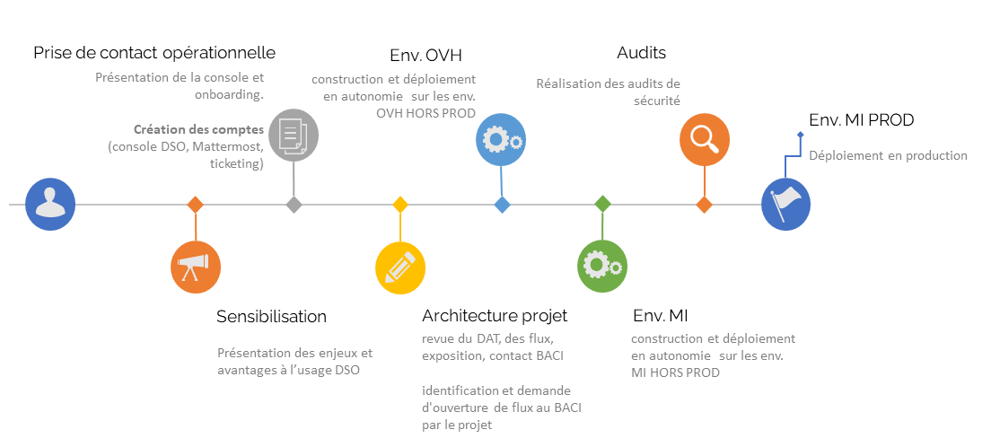

# Accompagnement DSO

## Description
La Service Team permet d'aider les équipes projets à embarquer sur l'offre DSO dans de bonnes conditions. Notre objectif est de vous accompagner et de vous aider dans le déploiement réussi de vos applications sur notre plateforme.

## Outils de communication

Pour contacter la service Team, plusieurs moyens sont mis en place :
 - Un outil de ticketing (moyen privilégié car permet de tracer les demandes)
 - Un outil de discussion en ligne: Mattermost

## Ticketing

Pour une meilleure traçabilité des échanges, nous avons mis en place un outil de ticketing permettant aux projets de faire des demandes ou de remonter des incidents à la Service Team.

- Voici le lien pour s'y rendre: https://support.numerique-interieur.com.

## Mattermost

Pour une meilleure fluidité des échanges, nous avons également mis en place un tchat dont voici l'[URL](https://mattermost.fabrique-numerique.fr/)

## Le processus d'embarquement

Le processus d'embarquement classique d'un projet est présenté ci-dessous :

> A chaque étape, la vérification des prérequis est un point d'étape *obligatoire* permettant de valider la compatibilité du projet avec l'offre DSO.
