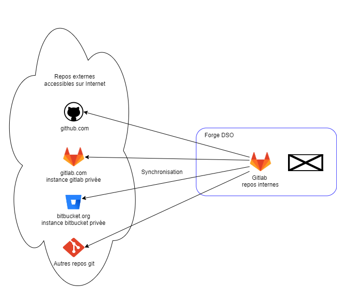
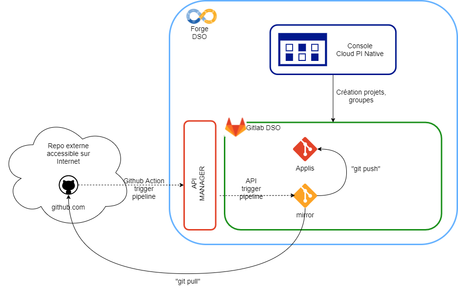
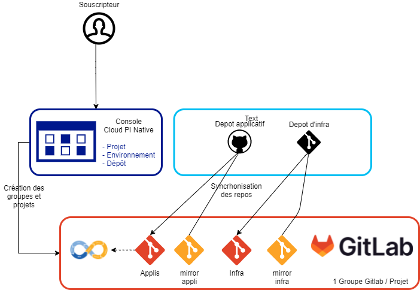

# Gestionnaire de sources

## Présentation
Le gestionnaire de source de l'offre Cloud π Native est Gitlab en version communautaire.

Le principe de l'offre Cloud π Native est de laisser les projets autonomes sur leur chaine de construction sur les environnements de développement et notamment les outils utilisés. Ainsi, une équipe projet peut utiliser le gestionnaire de source qu'il souhaite en amont de l'offre Cloud π Native : Github, Gitlab.com, Bitbucket, Gitlab on premise, etc. et sur des repos publics ou privés. La seule contrainte est que ce gestionnaire soit **accessible depuis Internet** afin qu'il puisse être *copié* sur l'offre Cloud π Native.

Dans la suite de cette page :
  - *repo externe* correspond au repo GIT de dev sur l'outil choisi par le projet;
  - *repo interne* correspond à la copie du repo externe dans l'offre Cloud π Native;
  - *gitlab interne* correspond à l'instance gitlab de l'offre Cloud π Native.

> la copie des repos externes vers le gitlab interne est piloté par le Gitlab interne. Le flux de synchronisation *part* de l'instance gitlab interne.

 ## Import d'un repos externe depuis la Console DSO

La déclaration de repos externes à synchroniser se fait depuis la Console Cloud π Native, après avoir créé un projet. Les opérations suivantes sont réalisées par la Console DSO:
 - Création d'un groupe Gitlab : <NOM_ORGANISATION>/<NOM_PROJET> sur le gitlab interne;
 - Attribution de droits d'administration sur le groupe Gitlab <NOM_ORGANISATION>/<NOM_PROJET>à l'utilisateur qui crée le projet;
 - Création d'un repo vide correspondant au repo distant dans le groupe ci-dessus;
 - Création d'un repo "mirror" avec les informations de synchrnonisation permettant, de réaliser un mirroir du repo GIT externe de dev. vers le repo interne créé ci-dessus.

Les repos externes, sont synchronisés par la pipeline gitlab-ci du projet *mirror* correspondant. Le déclenchement de cette synchronisation est réalisé par un appel à un API Management ( voir la page de [FAQ](../faq.md) )

Une fois le projet applicatif synchronisé une pipeline gitlab-ci est lancé afin de construire le projet applicatif sur l'offre Cloud π Native.

## Types de repos

Deux types de repos sont pris en comptes par l'offre Cloud π Native :
 - Repo applicatifs
 - Repo d'infra.

### Repos applicatifs et chaine de construction Gitlab-ci 

Les repos applicatifs contiennent du code applicatifs et génèrent des images à déployer sur Openshift.

Les projets présents sur l'offre π Native sont paramétrés pour exécuter une pipeline gitlab-ci depuis le fichier **gitlab-ci-dso.yml** présent à la racine du projet. Ce fichier doit être créé en amont depuis le repo externe. L'offre Cloud π Native propose des templates de ces fichiers pour la construction de projets de différents langages (Java, nodejs, python, etc.) accessibles lors de la création des projets depuis la Console DSO. Ces templates sont directement paramétrés pour utiliser des variables prédéfinies liées au projet courant. Cependant, ils sont donnés à titre d'exemple et doivent être adaptés aux besoins réels des projets.

Les projets applicatifs sont analysés et construits et les images Docker générés sont analysées et déposées sur un repos Quay prêtes à être déployées.

### Variables prédéfinies gitlab-ci DSO

Un certains nombres de variables pré-définies, en plus des variables standards de gitlab :
 - http_proxy, https_proxy, HTTP_PROXY et HTTPS_PROXY, PROXY_HOST, PROXY_PORT,  : paramètres liés au proxy de l'environnement.
 - MVN_CONFIG_FILE : fichier de configuration Maven avec le paramètrage pré-défini de l'environnement et du projet en cours, notamment pour le dépot d'artefact sur le repo Nexus.
 - NEXUS_HOST_URL : URL d'accès au repo Nexus (stockage d'artefacts)
 - NEXUS_HOSTNAME : Hostname du service Nexus
 - NO_PROXY : variable contenant les URL qui ne nécessitent pas de passer par le proxy
 - NPM_FILE : Fichier de configuration NPM pré-configuré pour l'environnement et le projet en cours
 - QUAY_ROOT_URL : URL d'accès à l'instance Quay (image repository)
 - SONAR_HOST_URL : URL d'accès à l'instance SonarQube (analyse de qualité statique)
 - VAULT_AUTH_PATH : PATH dans l'URL d'accès à VAULT pour l'authentification par jwt
 - VAULT_AUTH_ROLE : PATH dans l'URL d'accès à VAULT pour la récupération des roles depuis les appels de Gitlab
 - VAULT_SERVER_URL : URL d'accès à l'instance Vault (gestionnaire de secrets)
 
### Repos d'infra

Suivant les principes *GitOps*, les déploiements sur openShift sont pilotés par un repo git contenant des manifests ou helm charts. Ces repos sont nommés repos d'infras et permettent de déployer les images créée par les repos applicatifs.

Ces repos ne contruisent pas d'artefacts mais sont utilisés par ArgoCD afin de déployer l'infrastructure applictive sur Openshift. Ces repos peuvent être au format **Kustomize** ou **Helm** et déploient l'applicatif sur un namespace dédié au projet et automatiquement créé par la console DSO.

## Schéma de fonctionnement
Le schéma ci-dessous présente le fonctionnement général : 

